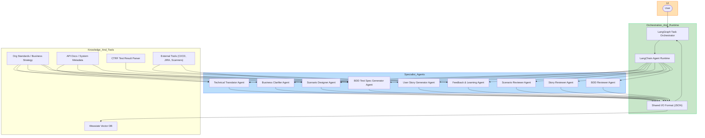

# Architecture

## 📐 Orchestration & Control Plane

Responsible for coordinating agent interactions, task delegation, state management, and user
interaction.

| Component                                            | Description                                                                                                  |
|------------------------------------------------------|--------------------------------------------------------------------------------------------------------------|
| Task Orchestrator (LangGraph)                        | Routes data and decisions between agents. Tracks progress, handles retries, parallelism, and feedback loops. |
| Prompt Context Manager                               | Assembles and passes relevant documents, memory, and results to each agent to maintain continuity.           |
| Interaction Manager                                  | Handles user conversations and clarifications. Bridges user input to agent-specific tasks.                   |

## 🧠 Specialist Agent Layer

Each agent is autonomous, with a focused responsibility and access to shared memory and
documentation. They may be chained sequentially, branched, or run in review/reflection loops.

### Agent Roles & Responsibilities

| Agent                         | Description                                                                                                        |
|-------------------------------|--------------------------------------------------------------------------------------------------------------------|
| Business Clarifier Agent      | Interacts with the user to refine goals and document clear business requirements.                                  |
| Technical Translator Agent    | Converts business requirements into structured technical requirements, system assumptions, and constraints.        |
| Scenario Designer Agent       | Creates Gherkin-style scenarios based on each requirement. Can request clarification from upstream agents or user. |
| Scenario Reviewer Agent       | Reviews and refines scenario quality, risk coverage, logical gaps, or duplication.                                 |
| User Story Generator Agent    | Slices refined requirements into structured user stories with acceptance criteria.                                 |
| Story Reviewer Agent          | Validates stories against principles like INVEST (Independent, Negotiable, etc.) and org-specific standards.       |
| BDD Test Spec Generator Agent | Converts each scenario into an executable .feature file with proper tagging and naming conventions.                |
| BDD Reviewer Agent            | Performs linting, structure validation, and cross-checks against scenarios.                                        |
| Feedback & Learning Agent     | Analyzes test results, defects, and outcomes to refine artifacts. Stores heuristics for future use.                |

Agents share structured input/output schemas (JSON), and are coordinated via the orchestrator.

## 📚 Knowledge, Tooling & Feedback Layer

This layer gives the agents long-term memory, organizational context, and tools to act
intelligently and consistently.

### Knowledge Store

| Source                    | Purpose                                                 |
|---------------------------|---------------------------------------------------------|
| Org Standards Docs        | Testing guidelines, story templates, coding conventions |
| Business Strategy Docs    | Strategic goals, personas, KPIs                         |
| System Architecture Docs  | Service dependencies, APIs, data schemas                |
| Test & Defect History     | Past test results, flake analysis, common root causes   |

Use vector DBs (Weaviate) for embeddings-backed retrieval, optionally with RAG techniques.

### Tool Interfaces (Optional Plugins/Helpers)

| Tool                 | Purpose                                                                              |
|----------------------|--------------------------------------------------------------------------------------|
| File I/O Tool        | Read/write to project folders (e.g., .feature, .md, .json)                           |
| JIRA Integrator      | Pull requirements, sync user stories, push test cases                                |
| Test Result Parser   | Ingest logs, CI pipeline output, performance metrics                                 |
| Security Scanner API | Evaluate scenarios/specs for security implications                                   |
| API Doc Fetcher      | Auto-fetch Swagger/OpenAPI or Postman collections for endpoint-based test generation |

### 🔄 Feedback & Continuous Improvement Loop

#### Heuristic Refinement

Adjust agent prompt weights or behaviors

#### Org-Specific Adaptation

Refine behavior to better fit the domain (e.g., fintech, medtech, retail)

Optionally tracked via a Knowledge Graph or Metadata Index, showing traceability across stories, scenarios, specs, and defects.

## 🔧 Deployment Options

| Stack                                                          | Notes                                                       |
|----------------------------------------------------------------|-------------------------------------------------------------|
| Local Dev Agent Network                                        | Ideal for on-prem compliance-sensitive orgs                 |
| Cloud Agent Runtime (LangChain Server)                         | Easily scalable and collaborative                           |
| Auth + RBAC Layer                                              | Ensure agents act only within permissioned bounds           |
| CI/CD Integration                                              | Agents triggered on PR, story creation, or pipeline failure |

## 🖼️ Architecture Diagram

